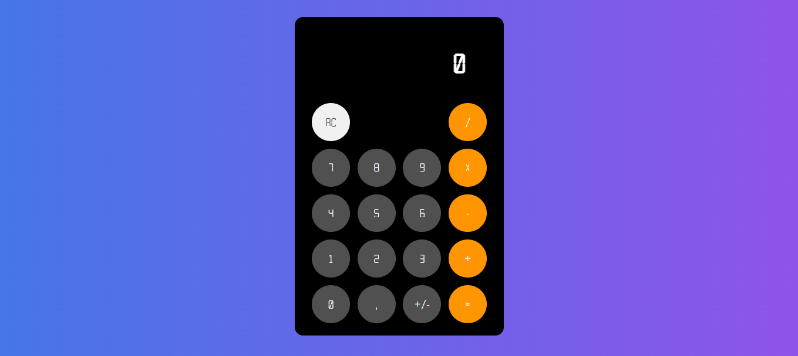

# Calculadora em React

A calculadora permite a possibilita de realização de cálculos relacionados à Matemática básica como operações da adição, subtração, multiplicação e divisão.

## Stack utilizada

**Front-end:** React, Typescript.

